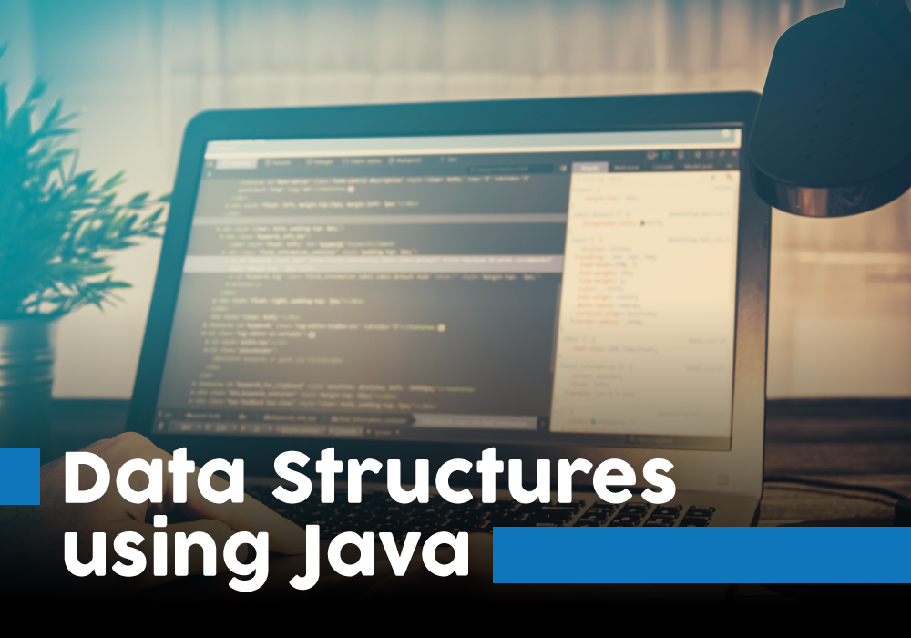

<p align="center"></p>

# Java : Data Structures (DS)
All the data structures are implemented in java.
This is a collection of all the data structures I am implementing for my educational purpose. The code is optimized and is written to be correct and readable. All the data structures are tested and, believed to be correct.

## Tests

### Compile
for compiling the program write down:
```
	javac file_name.java
```

### Run
to run the program write down:
```
	java file_name
```

# What's been implemented:

## Table of Contents

- Array

## Data Structures

- Array

	- One Dimensional Array
		- Search, Insert and Delete in an unsorted array
		- Insert, Search and Delete operations in a Sorted Array
		- Traversing 
			- Iterative Way
			- Recursive Method

	- Two Dimensional Array
		- Traversing
		- Updation

	- Multi-dimensional Array (Traversing)

- Linked List

	- Singly Linked List
		- Create, display and traverse
		- Insertion
			- At beginning
			- At end
			- After a specified position
		- Deletion
			- At beginning
			- At end
			- From a specified position
		- Length
			- Iterative
			- Recursive
		- Reverse
			- Iterative
			- Recursive

	- Circular Linked List
		- Create, display and traverse by using head and tail pointer
		- Create, display and traverse by using only tail pointer
		- Insertion
			- At beginning
			- At end
			- After a specified position
		- Deletion
			- At beginning
			- At end
			- From a specified position
		- Length
			- Iterative
		- Reverse
			- Iterative

	- Doubly Linked List
		- Create, display and traverse the doubly linked list
		- Insertion
			- At beginning
			- At end
			- At specified position
		- Deletion
			- From beginning
			- From end
			- From a specified position
		- Length
			- Iterative
		- Reverse
			- Iterative
		- Traverse the list from tail - in backward direction

	- Doubly Circular Linked List
		- Create, display and traverse the doubly circular linked list
		- Insertion
			- At end
			- At specified position
		- Deletion
			- From beginning
			- From a specified position
		- Length
			- Iterative
		- Reverse
			- Iterative

- Stack

	- Stack Implementation Using Arrays(Static memory allocation)
	- Stack Implementation Using Linked List(Dynamic memory allocation)

	- Applications of Stack Data Structure

		- Infix to Postfix Conversion[Expression]
		- Infix expression into Prefix expression conversion
		- Evaluation of Prefix Expression
		- Evaluation of Postfix Expression

- Queue

	- Implementation of the Queue using an Array
	- Implementation of the Queue using the Linked List
	- Implementation of the Queue using the Stacks

	- Circular Queue

		- Circular Queue -> Array Implementation
		- Circular Queue -> Linked List Implementation


- Interview Preparation Problems

	- Towers of Hanoi -> 3 towers and n-disks
	- Towers of Hanoi -> 4 towers and n disks

## Contributing
Keep contributing your idea or programs to this project.

<p align="center">😊</p>